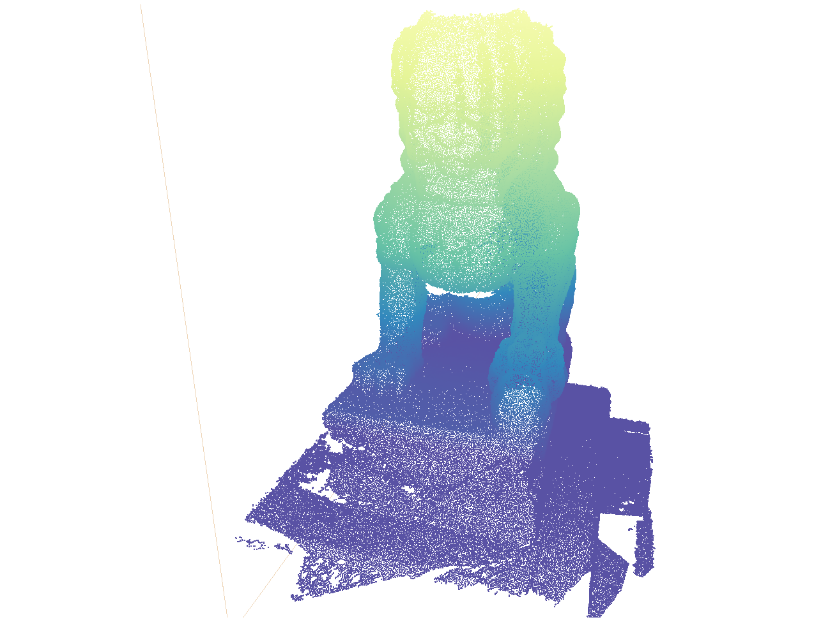

# 基于`Potree`的`3D`点云模型展示

## 说明

* 安装
```
yarn install
```

* 运行
```
yarn run serve
```

* 点云模型参数设置

1. 点云数据生成[Potree Converter](https://github.com/potree/PotreeConverter)；

2. 浏览器访问`http://localhost:8080`

* 效果

