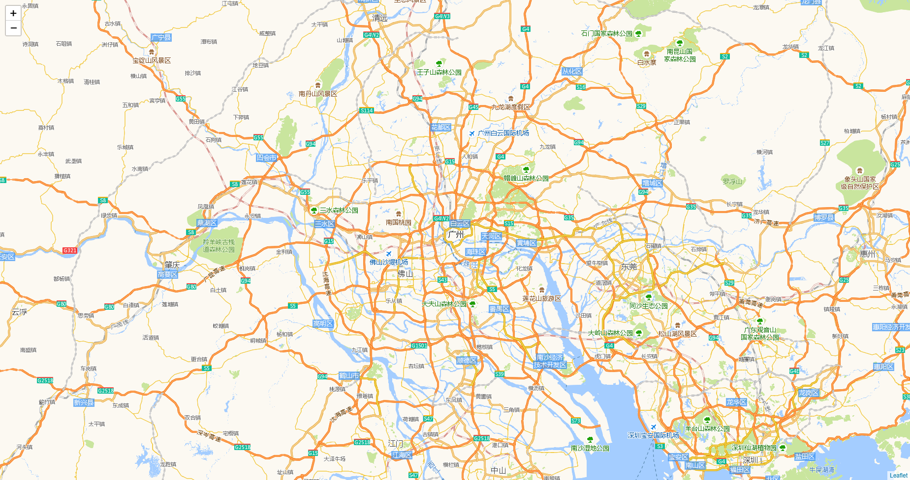

# 离线瓦片地图服务

* 用 `Go` 编写的瓦片地图爬取工具；

* 瓦片存入 `MongoDB`，为后期构建分布式文件存储准备；

* `Go` 构建地图服务，并加入 `Redis` 缓存层。

## 瓦片爬取

爬取程序：`go run Crawk.go`

* 爬取参数

爬取地址：`http://webrd01.is.autonavi.com/appmaptile?lang=zh_cn&size=1&scale=1&style=8&x={x}&y={y}&z={z}`

区域范围： `109.227°E ~ 117.182°E`  `20.196°N ~ 25.5°N`

瓦片等级：`12`

## 地图服务

服务程序：`go run Server.go`

