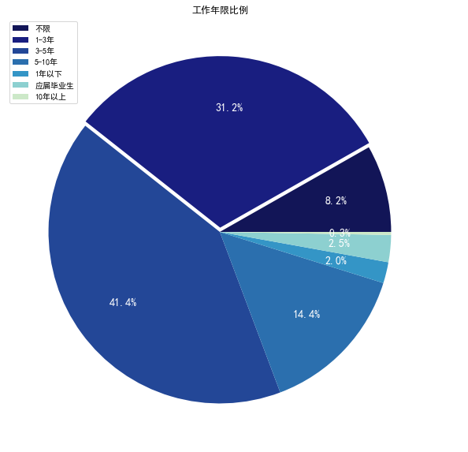
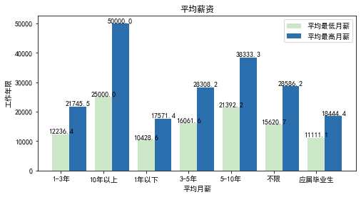
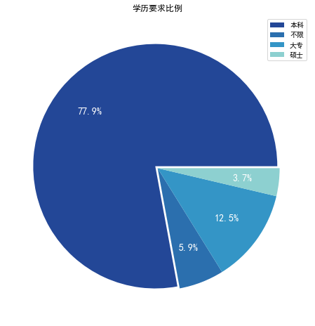
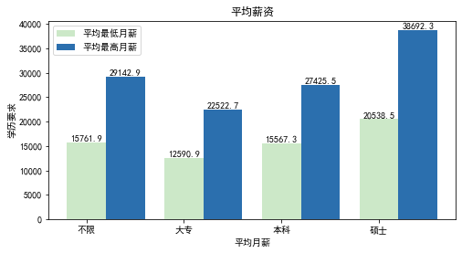
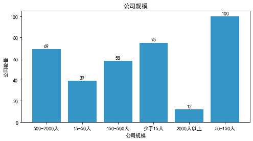
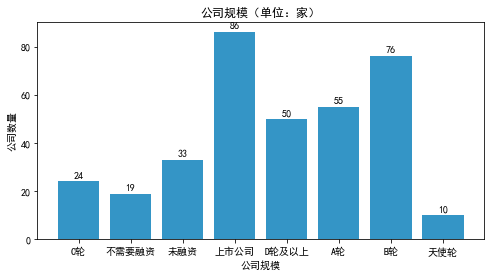
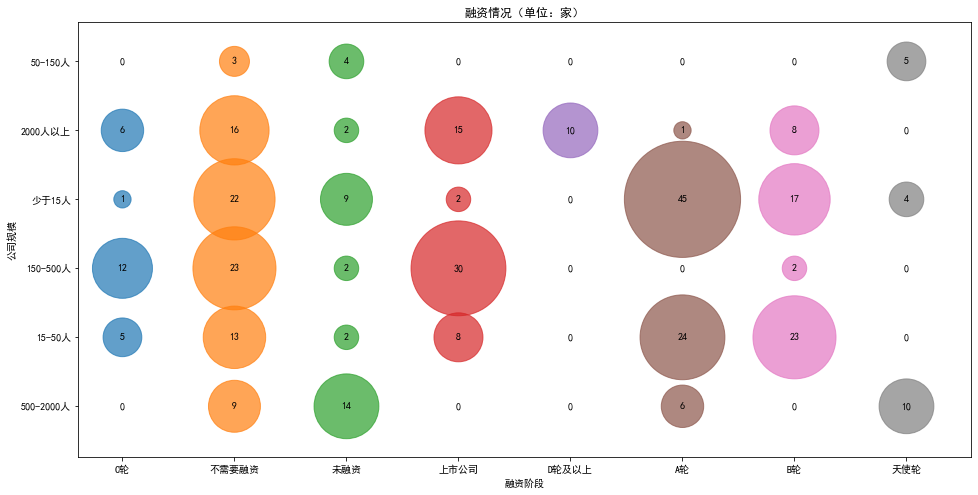
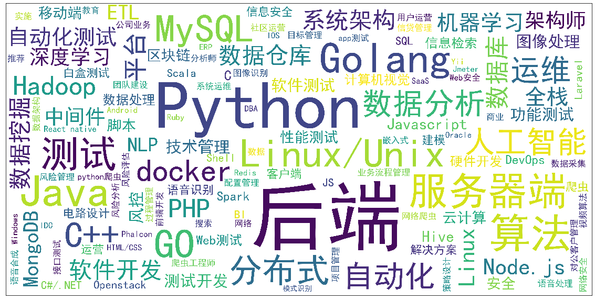

# 招聘网站爬取并可视化

## 爬取

爬取程序为[`crawl.py`](./crawl.py)

直接运行即可进行爬取，`python3 ./crawl.py`。

* 说明：爬取的招聘网站为拉勾网，其**职位详情页**有反爬策略，即单个`cookies`不可连续获取`2`次详情页内容，这里使用代理请求首页来更新`cookies`，保证正常的详情页爬取。

## 数据可视化

可视化文档为[`data_analysis.ipynb`](./data_analysis.ipynb)

**数据分析 & 可视化：**

* 职位关键词`Top 10`

* `HR`活跃时间分布

通过分析`HR`的活跃时间，可以知道在大概早上`09:00 ~ 11:00` 和下午`14:00 ~ 18:00`这两个时间段进行简历投递会比较好。

* 工作年限要求比例

大部分企业需要的是工作经验为`1 ~ 3年`或者`3 ~ 5年`的求职者，其中需要工作经验`3 ~ 5`年的需求最大。

- * 平均月薪

在工作年限要求的角度下，这里统计得到的平均最低薪酬：`15978.65`，平均最高薪酬：`28998.44`。

可以看出，薪酬随着工作经验的增加也是水涨船高。

1) `1 ~ 3年`经验的求职者平均最低月薪为`12k`以上，最低平均最高月薪为`20k`以上；

2) `3 ~ 5年`经验的求职者平均最低月薪为`16k`以上，最低平均最高月薪为`28k`以上。

* 学历要求比例

- * 平均月薪

在学历要求要求的角度下，这里统计得到的平均最低薪酬：`16114.64`，平均最高薪酬：`29445.84`。

* 公司规模比例

* 融资情况比例

- * 融资情况与公司规模

这张图展现了不同融资阶段的公司规模。

* 招聘地区分布

可以看出，主要的公司位置集中在`南山`，`福田`，`宝安`这三个区。

* 技能词云

* 职位详情

这里对爬取到的**职位描述**进行了分词，提取其中出现的关键词，并做相关的统计。

- * 中文关键字`Top 20`

从上面的`关键词Top20`可以看出，所招聘的职位更加强调的是技能的把握、熟悉程度，以及工作经验、能力等。

- * 英文关键字`Top 50`

这张图大致展示了职位需要大概掌握的技能，职位更加强调数据库、缓存、`Linux`、网络`TCP`、`Web`等的掌握程度。

而就`Python后端`而言，有些职位可能不仅仅要求掌握`Python`这门语言，还会要求掌握`Java`，`Golang`，`C/C++`等多门语言。